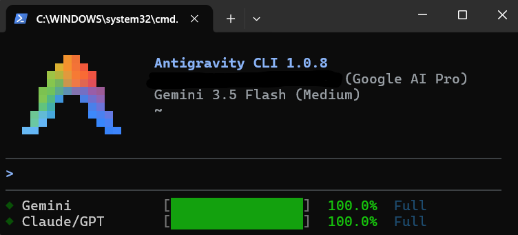

<h1 align="center">Antigravity CLI — Quota Statusline</h1>

<p align="center">
  
  
  
  
  
</p>

<p align="center">
  A custom status line for the <b>Antigravity CLI</b> (<code>agy</code>) that renders live,
  color-coded quota usage bars right under the prompt — see how much quota you have left
  without opening the <code>/usage</code> panel.
</p>

<!-- Add your screenshot at assets/screenshot.png -->
<p align="center">
  
</p>

```
◆ Gemini       [████████████████]  100.0%  Full
◆ Claude/GPT   [░░░░░░░░░░░░░░░░]    0.0%  Resets in 16m
```

Bars are colored by remaining quota:

| Remaining | Color |
| --- | --- |
| 70 – 100 % | 🟢 green |
| 30 – 70 % | 🟡 yellow |
| 0 – 30 % | 🔴 red |

---

## What it shows

Two quota groups — the same grouping as the `/usage` panel — each on its own line:

- **Gemini** — Gemini Pro + Gemini Flash (they share one quota pool)
- **Claude/GPT** — Claude Opus / Sonnet + GPT-OSS (they share one quota pool)

Each line shows the **remaining quota percentage**, a progress bar, and the **reset time**
(`Resets in 16m`, or `Full` when at 100 %). When a group has several models, the line
reflects the **most-constrained** one (lowest remaining).

---

## How it works

While a session is open, `agy` runs an embedded language server (inside `agy.exe`)
that exposes a Connect-RPC endpoint on a random local port. The statusline reads quota
from it in two pieces:

1. **`quota_refresh.ps1`** (background fetcher)
   - Finds the `agy.exe` process (or a standalone `language_server` when the Antigravity
     IDE is running) and its listening ports.
   - Calls `POST /exa.language_server_pb.LanguageServerService/GetUserStatus` with
     `Connect-Protocol-Version: 1`. The embedded server accepts local requests without a
     CSRF token; a discovered `--csrf_token` is sent as `X-Codeium-Csrf-Token` when present.
   - Parses each model's `remainingFraction` + `resetTime`, groups them into the two
     pools (Gemini, Claude/GPT), and writes `quota_cache.json`.

2. **`statusline.ps1`** (renderer)
   - Called by `agy` on every state change (session JSON piped on stdin).
   - Reads `quota_cache.json` and draws the bars.
   - If the cache is older than 60 seconds, it launches `quota_refresh.ps1` in the
     background (hidden window) — so rendering never blocks the TUI.

Ports and the CSRF token change every time `agy` restarts, so discovery is fully dynamic.

---

## Requirements

- **Windows:** PowerShell 5.1 (built-in)
- **macOS / Linux:** Bash 4.0+ & `lsof`
- Antigravity CLI (`agy`) installed and signed in — verify with `agy --version`
- An active `agy` session running (the language server must be up to serve quota)

---

## Quick Install

### Windows (PowerShell)

Run this single command in PowerShell:

```powershell
irm https://raw.githubusercontent.com/kubicix/agy-statusline/main/install-remote.ps1 | iex
```

### macOS / Linux (Bash)

Run this single command in terminal:

```bash
curl -sSL https://raw.githubusercontent.com/kubicix/agy-statusline/main/install-remote.sh | bash
```

That's it. Open a new `agy` session and the quota bars appear automatically.

<details>
<summary><b>Manual Install (git clone)</b></summary>

**Windows:**
```powershell
git clone https://github.com/kubicix/agy-statusline.git
cd agy-statusline
powershell -ExecutionPolicy Bypass -File .\install.ps1
```

**macOS / Linux:**
```bash
git clone https://github.com/kubicix/agy-statusline.git
cd agy-statusline
chmod +x install.sh
./install.sh
```

</details>

### What the installer does

1. Backs up your existing `settings.json` → `settings.json.bak`
2. Copies the renderer and background scripts to `~/.gemini/antigravity-cli/`
3. Sets `statusLine` in `settings.json` to run the renderer script
4. Writes an initial cache so the first frame shows a loading state

Then open a new session:

```powershell
agy
```

The bars appear below the input box and refresh automatically every 60 seconds.

---

## Configuration

The installer configures the `statusLine` section in your `~/.gemini/antigravity-cli/settings.json`.

**Windows:**
```json
{
  "statusLine": {
    "type": "command",
    "command": "powershell.exe -ExecutionPolicy Bypass -File C:/Users/<you>/.gemini/antigravity-cli/statusline.ps1",
    "enabled": true
  }
}
```

**macOS / Linux:**
```json
{
  "statusLine": {
    "type": "command",
    "command": "/bin/bash /Users/<you>/.gemini/antigravity-cli/statusline.sh",
    "enabled": true
  }
}
```

Tunable values at the top of the scripts:

| Script | Variable | Default | Meaning |
| --- | --- | --- | --- |
| `statusline.ps1` / `.sh` | `CACHE_MAX_AGE_SECONDS` | `60` | How old the cache may get before a background refresh fires |
| `statusline.ps1` / `.sh` | `BAR_WIDTH` | `16` | Progress bar width in characters |
| `quota_refresh.ps1` / `.sh` | `TIMEOUT_SECONDS` | `5` | Per-request HTTP timeout |

Color thresholds live in `Get-QuotaColor` / `get_quota_color` inside the renderer scripts.

---

## Uninstall

**Windows:**
```powershell
powershell -ExecutionPolicy Bypass -File .\uninstall.ps1
```

**macOS / Linux:**
```bash
./uninstall.sh
```

This restores `settings.json` from the backup (or clears the `statusLine` entry if no
backup exists) and removes the installed scripts and cache. Restart `agy` to apply.

---

## Limitations

- **Cross-platform.** Works natively on Windows (PowerShell) and macOS/Linux (Bash).
- **No weekly vs. 5-hour split.** The `/usage` panel shows separate *weekly* and
  *5-hour* limits per group. The local `GetUserStatus` API does **not** expose that
  breakdown — it returns a single effective `remainingFraction` + `resetTime` per model.
  This statusline shows that effective value. Weekly/5-hour numbers are only available
  inside the interactive `/usage` panel.
- Models in the same backend pool share quota, so e.g. Claude and GPT-OSS may move
  together.
- Numbers use the system locale decimal separator (so `100.0%` or `100,0%` depending on system locale).

---

## Troubleshooting

**Bars stuck at 0 % / "loading":**

- Make sure an `agy` session is actually running (the language server must be alive).
- Run the fetcher manually to see the error:
  ```powershell
  powershell -ExecutionPolicy Bypass -File quota_refresh.ps1
  Get-Content quota_cache.json
  ```
  Check the `error` field. `null` means success.

**No status line at all:**

- Confirm `settings.json` has the `statusLine` block and `enabled: true`.
- Open a *new* `agy` session after installing.

---

## Files

| File | Purpose |
| --- | --- |
| `statusline.ps1` | Renders the quota bars (called by `agy`) |
| `quota_refresh.ps1` | Background fetcher — queries the API, writes the cache |
| `quota_cache.json` | Latest quota snapshot |
| `install.ps1` | Local installer |
| `install-remote.ps1` | Remote one-liner installer (`irm \| iex`) |
| `uninstall.ps1` | Uninstaller |

---

## Contributing

Contributions are welcome. Found a bug, want a new feature, or have an
improvement? **Open an issue or send a pull request** — any addition or fix is
appreciated.

1. Fork the repo
2. Create a branch (`git checkout -b my-change`)
3. Commit your changes
4. Open a pull request

---

## Author

Created by **Kubilay Birer** ([@kubicix](https://github.com/kubicix)).

API reverse-engineering approach inspired by
[60ke/antigravity-statusline](https://github.com/60ke/antigravity-statusline).

## License

Free and open source under the **MIT License** — free to use, modify, and
distribute, no cost, no strings attached. See [LICENSE](LICENSE) for the full text.

© 2026 Kubilay Birer
