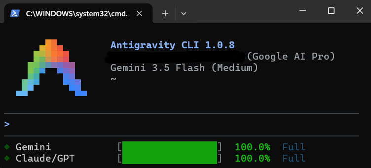

<h1 align="center">Antigravity CLI — Quota Statusline</h1>

<p align="center">
  
  
  
  
  
</p>

<p align="center">
  A custom status line for the <b>Antigravity CLI</b> (<code>agy</code>) that renders live,
  color-coded quota usage bars right under the prompt — see how much quota you have left
  without opening the <code>/usage</code> panel.
</p>

<!-- Add your screenshot at assets/screenshot.png -->
<p align="center">
  
</p>

```
on main *
◆ Gemini       [████████████████]  100.0%  Full
◆ Claude/GPT   [░░░░░░░░░░░░░░░░]    0.0%  Resets in 16m
■ Context      [██████████░░░░░░]   62.0%  38.0% used
```

Bars are colored by remaining quota:

| Remaining | Color |
| --- | --- |
| 70 – 100 % | 🟢 green |
| 30 – 70 % | 🟡 yellow |
| 0 – 30 % | 🔴 red |

---

## What it shows

- **Branch** — current git branch, with a `*` if the working tree is dirty
- **Gemini** / **Claude/GPT** — the same two quota groups the `/usage` panel shows,
  each on its own line. Each line shows the **remaining quota percentage**, a progress
  bar, and the **reset time** (`Resets in 16m`, or `Full` at 100 %). When a group has
  several models, the line reflects the **most-constrained** one (lowest remaining).
- **Context** — remaining context-window capacity for the current conversation

---

## How it works

`agy` pipes a JSON payload to the statusline command on **every agent state change** —
that payload already includes a `quota` object (per-model `remaining_fraction` /
`reset_in_seconds`), the current git branch, and context-window usage. `statusline.ps1`
/ `statusline.sh` just read that stdin payload and render it:

- Quota buckets are grouped into Gemini / Claude+GPT by matching the bucket key name,
  keeping the most-constrained bucket per group.
- Branch name + dirty flag come straight from the payload's `vcs` field.
- The context bar comes from `context_window.remaining_percentage`.

No background process, no cache file, no talking to the local language server — the
data agy already sends is used directly, so there's nothing to discover, poll, or go
stale.

---

## Requirements

- **Windows:** PowerShell 5.1 (built-in)
- **macOS / Linux:** Bash 4.0+ & `python3` (used to parse the JSON payload)
- Antigravity CLI (`agy`) installed and signed in — verify with `agy --version`

---

## Quick Install

### Windows (PowerShell)

Run this single command in PowerShell:

```powershell
irm https://raw.githubusercontent.com/kubicix/agy-statusline/main/install-remote.ps1 | iex
```

### macOS / Linux (Bash)

Run this single command in terminal:

```bash
curl -sSL https://raw.githubusercontent.com/kubicix/agy-statusline/main/install-remote.sh | bash
```

That's it. Open a new `agy` session and the quota bars appear automatically.

<details>
<summary><b>Manual Install (git clone)</b></summary>

**Windows:**
```powershell
git clone https://github.com/kubicix/agy-statusline.git
cd agy-statusline
powershell -ExecutionPolicy Bypass -File .\install.ps1
```

**macOS / Linux:**
```bash
git clone https://github.com/kubicix/agy-statusline.git
cd agy-statusline
chmod +x install.sh
./install.sh
```

</details>

### What the installer does

1. Backs up your existing `settings.json` → `settings.json.bak`
2. Copies the renderer script to `~/.gemini/antigravity-cli/`
3. Sets `statusLine` in `settings.json` to run the renderer script

Then open a new session:

```powershell
agy
```

The bars appear below the input box and update on every agent state change.

---

## Configuration

The installer configures the `statusLine` section in your `~/.gemini/antigravity-cli/settings.json`.

**Windows:**
```json
{
  "statusLine": {
    "type": "command",
    "command": "powershell.exe -ExecutionPolicy Bypass -File C:/Users/<you>/.gemini/antigravity-cli/statusline.ps1",
    "enabled": true
  }
}
```

**macOS / Linux:**
```json
{
  "statusLine": {
    "type": "command",
    "command": "/bin/bash /Users/<you>/.gemini/antigravity-cli/statusline.sh",
    "enabled": true
  }
}
```

Tunable values at the top of the scripts:

| Script | Variable | Default | Meaning |
| --- | --- | --- | --- |
| `statusline.ps1` / `.sh` | `BAR_WIDTH` | `16` | Progress bar width in characters |

Color thresholds live in `Get-QuotaColor` / `get_quota_color` inside the renderer scripts.

---

## Uninstall

**Windows:**
```powershell
powershell -ExecutionPolicy Bypass -File .\uninstall.ps1
```

**macOS / Linux:**
```bash
./uninstall.sh
```

This restores `settings.json` from the backup (or clears the `statusLine` entry if no
backup exists) and removes the installed script. Restart `agy` to apply.

---

## Limitations

- **Cross-platform.** Works natively on Windows (PowerShell) and macOS/Linux (Bash).
- Whatever `quota` bucket names/values `agy` sends is what's shown — if a bucket name
  doesn't match `gemini` or `claude|gpt`, it's ignored (open an issue if you hit that).
- Models in the same backend pool share quota, so e.g. Claude and GPT-OSS may move
  together.
- Numbers use the system locale decimal separator (so `100.0%` or `100,0%` depending on system locale).

---

## Troubleshooting

**Bars show "No quota data in payload yet":**

- Make sure you're on an `agy` version whose statusline payload includes the `quota`
  field (see [Antigravity's statusline docs](https://antigravity.google/docs/cli/statusline/)).
- Run `/usage` manually to confirm your session actually has quota data.

**No status line at all:**

- Confirm `settings.json` has the `statusLine` block and `enabled: true`.
- Open a *new* `agy` session after installing.

---

## Files

| File | Purpose |
| --- | --- |
| `statusline.ps1` / `.sh` | Renders the quota, branch and context bars (called by `agy` on every state change) |
| `install.ps1` / `.sh` | Local installer |
| `install-remote.ps1` / `.sh` | Remote one-liner installer (`irm \| iex`) |
| `uninstall.ps1` / `.sh` | Uninstaller |

---

## Contributing

Contributions are welcome. Found a bug, want a new feature, or have an
improvement? **Open an issue or send a pull request** — any addition or fix is
appreciated.

1. Fork the repo
2. Create a branch (`git checkout -b my-change`)
3. Commit your changes
4. Open a pull request

---

## Author

Created by **Kubilay Birer** ([@kubicix](https://github.com/kubicix)).

API reverse-engineering approach inspired by
[60ke/antigravity-statusline](https://github.com/60ke/antigravity-statusline).

## License

Free and open source under the **MIT License** — free to use, modify, and
distribute, no cost, no strings attached. See [LICENSE](LICENSE) for the full text.

© 2026 Kubilay Birer
